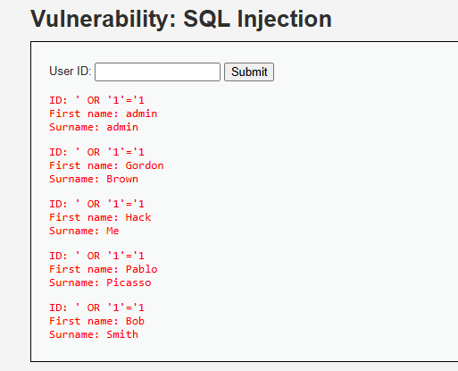

# 🔍 Análisis de Vulnerabilidad: Inyección SQL (SQL Injection)

---

## 1. Evidencia del Ataque
El ataque se ejecutó con éxito en el formulario de consulta de ID de usuario del portal de clientes del **Hotel Costa Brava**.

* **Payload utilizado:** `' OR '1'='1`
* **Resultado observado:** El sistema ignoró la restricción del ID original y expuso la totalidad de la base de datos de los clientes registrados (nombres, apellidos y datos asociados).

<div align="center">
  
  <p><em>Figura 1.1: Evidencia de explotación de Inyección SQL en el formulario de consulta, logrando la exfiltración masiva de registros en el entorno simulado del portal de clientes del Hotel Costa Brava.</em></p>
</div>

---

## 2. Explicación Técnica
La vulnerabilidad existe porque la aplicación concatena directamente la entrada del usuario en la consulta SQL sin realizar ningún tipo de sanitización o parametrización.

La consulta interna en el servidor es similar a:
```sql
SELECT first_name, last_name FROM users WHERE user_id = '$USER_INPUT';