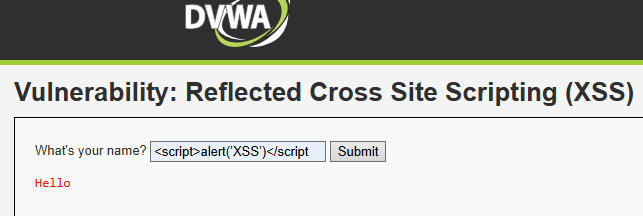

# 🔍 Análisis de Vulnerabilidad: Cross-Site Scripting (XSS Reflected)

---

## 1. Evidencia del Ataque
El ataque se ejecutó explotando la falta de validación y codificación en los campos de entrada de texto que se reflejan directamente en la interfaz del portal.

* **Payload utilizado:** ``
* **Resultado observado:** El navegador web interpretó y ejecutó de forma inmediata el código JavaScript inyectado, desplegando una ventana emergente de alerta local.

*Figura 2.1: Evidencia de inyección de script arbitrario (XSS Reflejado) en el formulario del portal de clientes, simulando el compromiso del entorno web del Hotel Costa Brava.*

---

## 2. Explicación Técnica
El XSS Reflejado ocurre cuando una aplicación web recibe datos en una solicitud HTTP y los incluye dentro de la respuesta inmediata sin sanitizarlos, filtrarlos o aplicarles un *escape* adecuado a nivel de contexto HTML. 

Esto rompe la barrera de confianza del navegador de la víctima, permitiendo que un tercero ejecute código malicioso en el contexto de seguridad de la sesión activa del usuario.

---

## 3. Puntaje y Severidad CVSS
Para evaluar la gravedad de este hallazgo, se utilizó la calculadora oficial de FIRST (CVSS v3.1):

| Métrica CVSS 3.1 | Puntuación | Severidad |
| :--- | :---: | :---: |
| **CVSS Base Score** | **6.1** | 🟡 **Media** |

* **Vector de ataque:** `CVSS:3.1/AV:N/AC:L/PR:N/UI:R/S:U/C:L/I:L/A:N`
* **Justificación:** El ataque requiere que un usuario caiga en un engaño e interactúe con un enlace malicioso (UI:R). Aunque no compromete el servidor por completo, expone directamente la privacidad de las acciones de los huéspedes en el portal.

---

## 4. Impacto para Hotel Costa Brava
Si esta vulnerabilidad se presentara en producción, un atacante remoto podría:
* **Robar cookies de sesión:** Secuestrar la sesión activa de clientes (*Session Hijacking*) evadiendo los formularios de login habituales.
* **Redireccionar clientes:** Desviar el tráfico de reservas reales hacia portales clonados o pasarelas de pago fraudulentas (*Phishing*).
* **Capturar credenciales:** Modificar visualmente formularios legítimos para interceptar contraseñas o datos de tarjetas bancarias.

---

## 5. Políticas de Prevención y Mitigación

### Política de Prevención (Causa Raíz)
* **Codificación de Salida (Context-Aware Output Encoding):** Implementar funciones nativas que conviertan caracteres especiales de HTML (como `<`, `>`, `&`, `"`, `'`) en sus entidades seguras equivalentes antes de renderizarlas en la pantalla.
* **Implementación de Content Security Policy (CSP):** Configurar cabeceras HTTP que restrinjan estrictamente el origen de ejecución de scripts, bloqueando la inyección e interpretación de código inline malicioso.

### Control de Mitigación (Defensa en Capas bajo OWASP Top 10)
* **Atributos de Seguridad en Cookies:** Forzar las directivas `HttpOnly` y `Secure` en todas las cookies de sesión del portal para evitar que sean legibles mediante código JavaScript inyectado, neutralizando el impacto del robo de credenciales.
* **Sanitización Automática:** Integrar librerías específicas de sanitización de HTML (como DOMPurify o similares) en el pipeline de datos antes de procesar entradas dinámicas de usuarios.