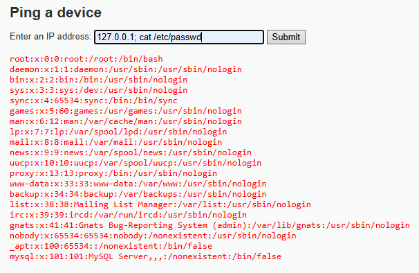

# Vulnerabilidad: Inyección de Comandos (Command Injection)



## Evidencia

Durante la auditoría se ejecutó el siguiente payload:

```bash
127.0.0.1; cat /etc/passwd
```

La aplicación ejecutó ambos comandos, mostrando el contenido del archivo `/etc/passwd`, lo que demuestra que el servidor interpreta directamente la entrada del usuario como comandos del sistema operativo.

## Explicación Técnica

La vulnerabilidad de Inyección de Comandos ocurre cuando una aplicación ejecuta comandos del sistema utilizando información ingresada por el usuario sin realizar validaciones.

El atacante puede concatenar nuevos comandos utilizando caracteres especiales como `;`, `&&` o `|`, logrando ejecutar instrucciones arbitrarias sobre el servidor.

En un entorno real, esta vulnerabilidad podría permitir la obtención de archivos sensibles, la instalación de malware, el robo de información o incluso el control total del servidor.

## Impacto para Hotel Costa Brava

Si esta vulnerabilidad estuviera presente en el portal del Hotel Costa Brava, un atacante podría:

- Acceder a archivos internos del servidor.
- Robar bases de datos completas.
- Obtener credenciales del sistema.
- Instalar software malicioso.
- Interrumpir el servicio de reservas.
- Comprometer la infraestructura del hotel.

Las consecuencias afectarían gravemente la disponibilidad del servicio, la confidencialidad de los datos y la continuidad operacional.

## CVSS v3.1

**Puntaje:** 9.8

**Severidad:** Crítica

### Justificación

- Ataque remoto.
- Baja complejidad.
- Sin privilegios previos.
- Compromiso total de confidencialidad.
- Compromiso total de integridad.
- Compromiso total de disponibilidad.

## Política de Prevención

- Nunca ejecutar comandos utilizando entradas del usuario.
- Validar estrictamente todos los parámetros.
- Aplicar listas blancas (Whitelist).
- Ejecutar servicios con el mínimo privilegio posible.

## Controles de Mitigación

- Deshabilitar funciones peligrosas.
- Monitorear procesos del servidor.
- Implementar un Web Application Firewall (WAF).
- Segmentar servicios críticos.
- Actualizar permanentemente el sistema operativo.